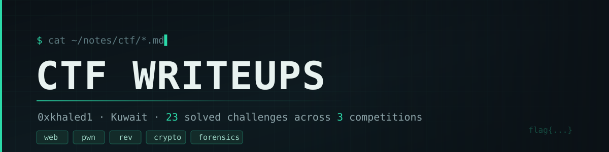

<div align="center">



[](#index)
[](#index)
[](https://github.com/KhaledAlsaqabi/ctf-writeups/commits/main)
[](https://github.com/KhaledAlsaqabi/ctf-writeups/stargazers)

</div>

---

## About

Full write-ups for CTF challenges I solved &mdash; every one written to be **reproducible**: the recon that led
to the bug, the reasoning behind each step, the working exploit, and the root cause in the code.

Nothing here is a solve log. If you can read the write-up and land the flag yourself, it did its job.

**Coverage:** `Web` 16 &middot; `Pwn` 2 &middot; `Rev` 2 &middot; `Misc / Rev` 1 &middot; `Forensics` 1 &middot; `Crypto` 1

---

## Index

### Exploit3rs CTF

| Challenge | Category | Difficulty | Points |
| :--- | :--- | :--- | ---: |
| [Black Site](Exploit3rs/Black%20Site/README.md) | Web | Easy | — |
| [Catalyst Breach](Exploit3rs/Catalyst%20Breach/README.md) | Web | Hard | — |
| [Noor Gate](Exploit3rs/Noor%20Gate/README.md) | Web | Easy | 150 |
| [Phantom Relay](Exploit3rs/Phantom%20Relay/README.md) | Web | — | — |
| [Pipeline Phantom](Exploit3rs/Pipeline%20Phantom/README.md) | Web | — | — |
| [Router Backdoor](Exploit3rs/Router%20Backdoor/README.md) | Web | — | — |
| [Sadaqah Drive](Exploit3rs/Sadaqah%20Drive/README.md) | Web | Easy | — |
| [The Broken Crescent](Exploit3rs/The%20Broken%20Crescent/README.md) | Web | Medium | — |
| [The Laylat Script](Exploit3rs/The%20Laylat%20Script/README.md) | Web | — | — |

### Ramadan CTF 2026 &mdash; VulnByDefault

| Challenge | Category | Difficulty | Points |
| :--- | :--- | :--- | ---: |
| [GiftForge](ramadan-ctf-2026b/GiftForge/README.md) | Web | Very Easy | — |
| [JITstream](ramadan-ctf-2026b/JITstream/README.md) | Pwn | Medium | — |
| [LosSantosCustoms](ramadan-ctf-2026b/LosSantosCustoms/README.md) | Web | Medium | — |
| [Notey](ramadan-ctf-2026b/Notey/README.md) | Web | Easy | — |
| [QuizApp](ramadan-ctf-2026b/QuizApp/README.md) | Web | Hard | 150 |
| [Ruby](ramadan-ctf-2026b/Ruby/README.md) | Misc / Rev | Medium | — |
| [Validator](ramadan-ctf-2026b/Validator/README.md) | Rev | Medium | — |
| [Zippy](ramadan-ctf-2026b/Zippy/README.md) | Forensics | Easy | 75 |

### TKB CTF

| Challenge | Category | Difficulty | Points |
| :--- | :--- | :--- | ---: |
| [Capture The F__l__a__g](tkbctf/capture-the-f-l-a-g%20/README.md) | Web | — | 220 |
| [Dream of You](tkbctf/Dream%20of%20You/README.md) | Web | — | 182 |
| [Patisserie](tkbctf/Patisserie/README.md) | Web | — | 110 |
| [pyfsb](tkbctf/pyfsb/README.md) | Pwn | — | 159 |
| [README.pdf](tkbctf/README.pdf/writeup.md) | Rev | — | 90 |
| [Single Hint RSA](tkbctf/Single%20Hint%20RSA/README.md) | Crypto | — | 96 |

---

## Repository Layout

```
ctf-writeups/
├── Exploit3rs/            # one folder per challenge, each with its own README.md
├── ramadan-ctf-2026b/
├── tkbctf/
├── TEMPLATE.md            # the structure every write-up follows
└── README.md
```

Screenshots and other assets live in an `assets/` folder next to the write-up that uses them,
referenced with repo-relative paths so they render for everyone.

---

## Writing a New One

Start from [`TEMPLATE.md`](TEMPLATE.md). It fixes the section order and the `Challenge Info`
block, and documents the conventions for image paths, folder names, code fences and flags.

---

## Disclaimer

These write-ups describe challenges from CTF competitions &mdash; deliberately vulnerable targets built
for that purpose. The techniques are published for learning and defensive research. Do not point
them at systems you are not authorised to test.

---

<div align="center">
<sub>Written by <a href="https://github.com/KhaledAlsaqabi">0xkhaled1</a> &middot; found a mistake? <a href="https://github.com/KhaledAlsaqabi/ctf-writeups/issues">open an issue</a></sub>
</div>
